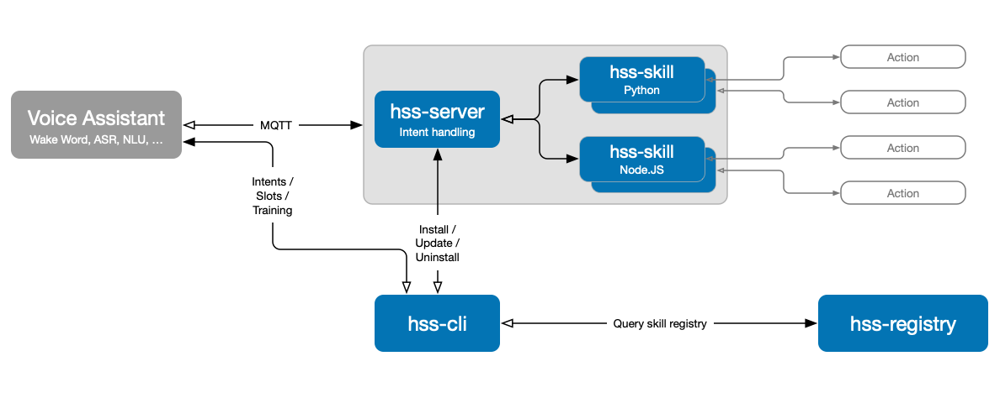

 

# Hermes Skill Server

Modular intent handling server based on the Hermes MQTT protocol. 

# Features

The HSS Skill Server is built as platform for skills, and manages the MQTT connection to the voice assistant. Skills are running as separate processes in custody of the server, each with its own environment and configuration. Connection between skill server and skills is implemented using a simple RPC protocol, and therefore allows to run skills written in different programming languages. Currently, there are bindings for Python and Node.JS available (see below).

The server will listen for intents on the hermes intent-topic (`hermes/intent/#`). When intents are processed, the responses will be published to the according hermes topics (such as `hermes/dialogueManager/endSession`). The skill implementation can make use of several hermes topics (e.g. to answer follow up questions, or start new sessions).



When started, the server loads all available skills from the skills directory and start them as separate process. For every incoming intent which is published via MQTT, the skill-server tries to find a matching skill, and, if found, hands the intent over to the skill so it can be handled. 

Skills can be managed easily using the `hss-cli` commandline tool (see below).

The HSS Skill Server is compatible with the [Rhasspy voice assistant](https://github.com/synesthesiam/rhasspy).

In order to ease the installation process further, a dedicated skill registry / marketplace was developed: The **HSS Skill Registry**. It is running as heroku app at [https://hss-registry.herokuapp.com/](https://hss-registry.herokuapp.com/). For details see the **Registry** chapter below.

### Demo


```
(hss) hss@ceres:/srv/hss $ hss-server
INFO:hss: Hermes Skill Server v0.5.0
INFO:hss: Using config directory: '/home/hss/.config/hss_server'
INFO:hss: Using skills directory: '/home/hss/.config/hss_server/skills'
INFO:hss_server.skillserver: Sending TTS response to 'http://calypso.universe:12101/api/text-to-speech'
INFO:hss_server.skillserver: Starting RPC server ...
INFO:hss_server.skillserver: Loading skills ...
INFO:hss_server.collection: Loaded hss-python skill 'hss-skill-s710-weather' v1.0.0
INFO:hss_server.collection: Loaded hss-python skill 'hss-s710-lightsha' v1.0.0
INFO:hss_server.collection: Loaded hss-node skill 'hss-s710-nodedemo' v0.2.3
INFO:hss_server.collection: Loaded 3 skills
INFO:hss_server.skillserver: Connecting to MQTT server ...
INFO:hss_server.mqtt: Connecting to MQTT server ...
INFO:hss_server.mqtt: Connecting to mqtt://ceres.universe:1883 ...
INFO:hss_server.mqtt: Subscribing to hermes/intent/# ...
``` 

# Installation

The server is preferably installed within a virtualenv, and requires python >=3.7. 

## Default user (venv)

```
/home/s710 $> mkdir hss
/home/s710 $> cd hss
/home/s710/hss $> mkdir hss
/home/s710/hss $> python3.7 -m venv /home/s710/hss/venv

/home/s710/hss $> source venv/bin/activate
(venv) /home/s710/hss $> pip install hss_server

```

## Own user (venv)

It is also advised to have it run under a dedicated user. To do so, follow those steps, for a user named "hss" to be created and used:

```
pi@ceres:~ $ cd /srv
pi@ceres:/srv $ sudo useradd -rm hss
pi@ceres:/srv $ sudo mkdir hss
pi@ceres:/srv $ sudo chown hss:hss hss
pi@ceres:/srv $ sudo -u hss -H -s
hss@ceres:/srv $ cd hss
hss@ceres:/srv/hss $ python3 -m venv .
hss@ceres:/srv/hss $ source bin/activate
(venv) hss@ceres:/srv/hss $ python3 -m pip install pip --upgrade     # optional: update pip 
(venv) hss@ceres:/srv/hss $ pip install hss-server
```


## Config directory

After the initial start, `hss-server` creates its configuration file (`[USER_CONFIG_DIR]/hss_server/config.ini`). The config file will contain several configuration options, especially the location where skills are installed, which by default is `[USER_CONFIG_DIR]/hss_server/skills`.

On Linux, the `USER_CONFIG_DIR` will be `~/.config`, on MacOS it will be `~/Library/Application Support`.

## Updating

Just simply use `pip` again to update:

```
pi@ceres:~ $ cd /srv/hss
pi@ceres:/srv/hss $ sudo -u hss -H -s
hss@ceres:/srv/hss $ source bin/activate
(venv) hss@ceres:/srv/hss $ pip install hss_server --upgrade
```


# Configuration

The main configuration is stored within `[USER_CONFIG_DIR]/hss_server/config.ini`, and might look like the following:

```
[server]
skill_directory = /home/hss/.config/hss_server/skills
rpc_start_port = 51000
tts_url = http://calypso.universe:12101/api/text-to-speech
node = /usr/local/bin/node
npm = /usr/local/bin/npm

[mqtt]
server = ceres.universe
port = 1883

[registry]
host = https://hss-registry.herokuapp.com/
svcroot = /services/v1/

[topics]
intents = hermes/intent/#
start_session = hermes/dialogueManager/startSession
continue_session = hermes/dialogueManager/continueSession
end_session = hermes/dialogueManager/endSession
```

### Parameters in `config.ini` 

After initial installation, `hss-server` will assume default values for the MQTT server. Topics *should* never be changed unless there is a good reason, since those are given by the hermes MQTT protocol.

##### `server` / `skill_directory`
Directory where skills are installed.

##### `server` / `rpc_start_port` 
Starting port for RPC communication.

Default: `51000`.

##### `server` / `tts_url` 
If the `tts_url` parameter is configured, replies from skills will be sent via HTTP instead of MQTT (this is for rhasspy 2.4 backwards compatibility). 

Default: `None`,

##### `server` / `node` 
Path to the Node.JS binary `node`. Needed for running skills with platform `hss-node`. 

Default: `None`,

##### `server` / `npm` 
Path to the Node.JS binary `npm`. Needed for installing skills with platform `hss-node`. 

Default: `None`,


##### `mqtt`/ `server`
Hostname of the MQTT server.

Default: `localhost`.

##### `mqtt`/ `port`
Hostname of the MQTT server.

Default: `1883`.

##### `registry`/ `host`
Hostname of the HSS Skill Registry. 

Default: `https://hss-registry.herokuapp.com/`.

##### `registry `/ `svcroot `
Services root path of the HSS Skill Registry. 

Default: `/services/v1/`.

##### `topcis`/ `intents `
MQTT topic on which `hss-server` listens for intents.

Default: `hermes/intent/#`.

##### `topcis`/ `start_session `
MQTT topic where `hss-server` publishes start-session messages.

Default: `hermes/dialogueManager/startSession`.

##### `topcis`/ `continue_session `
MQTT topic where `hss-server` publishes continue-session messages.

Default: `hermes/dialogueManager/continueSession`.

##### `topcis`/ `end_session `
MQTT topic where `hss-server` publishes end-session messages.

Default: `hermes/dialogueManager/endSession`.


### Command line


In Addition, several command line switches are available:

```
Usage:
   $ ./hss-server [-dhv][-cl arg]

Options:

   -c [dir]           Directory path where the server's config.ini is located (default: user config dir)

   -l [file]          Log file to write log entries to (default: console)
   -d                 Enable debug log output

   --help             Show this help and exit
   -v, --version      Show version and exit
```


# CLI

The `hss-cli` tool is used to:

- list all installed skills
- install a skill
- uninstall a skill
- update one or all installed skills

## Usage

```
Usage:
   $ hss-cli [options]

Skills:

   -l                             List all installed skills.

   -i ([name]) (--url [url])      Install a new skill using [name]. [name] must be a valid HSS registry skill name.
                                  Optionally, [url] can be used to directly install a skill from a git repository.
   -u ([name])                    Update an already installed skill named [name].
                                  If [name] is ommited, ALL skills will be updated.
   -r [name]                      Uninstall an already installed skill named [name]

Registry:

   --search                       Query HSS registry for a list of available skills
       (--type [type])            Restrict registry query to the given type
       (--platform [platform])    Restrict registry query to the given platform
       (--lang [language])        Restrict registry query to the given language

   --publish -s [dir] -t [token]        Publishes a skill to the HSS registry. Required parameters are the
                                        skill's directory [dir] (containing skill.json) and the token [token] which was obtained
                                        when registering at the HSS registry.

   --unpublish -s [name] -t [token]     Removes an already published skill from the HSS registry. Required parameters are the
                                        skill's name [name] and the token [token] which was obtained
                                        when registering at the HSS registry.

   --register                           Registers a new account at the HSS registry.
   --unregister                         Deletes an existing account from the HSS registry. Will also delete all associated skills.

Help:

   -h, --help      Show this help and exit
   -v, --version   Show version and exit
```

For the **registry** related commands, see chapter **Registry** below.

## Installing

When installing skills, the HSS Skill Registry (see chapter "Registry") is queried for details about the skill. Especially the git repo URL is determined. It is also possible to skip querying the registry and instead install directly from a git repo URL.

Installing a skill involves the following steps:

- determine repository URL by querying HSS Skill Registry
- cloning the remote repository
- creating a virtualenv
- installing dependencies given by the skill developer (`requirements.txt`)
- asking the user for configuration parameters, if the skill provides the `config.ini.default` file
- (optional) register sentences at `rhasspy` (if a skill provides its own `sentences.ini`)
- (optional) register slots at `rhasspy` (if a skill provides its own `slots.json`)
- (optional) trigger `rhasspy` for training (if the skill provdes its own sentences/slots)

The server is automatically triggered for reload after installation, so the new skill will be instantly available.

Installing is done using the `-i` switch for `hss-cli` followed by the name of the skill as shown in the HSS Skill Registry. Optionally, instead of the skill name a direct git repo URL can be given with the `--url [URL]` switch.

```
(venv) hss@ceres:/srv/hss $ hss-cli -i hss-s710-weather
Installing 'hss-s710-weather' into '/home/hss/.config/hss_server/skills/hss-s710-weather'
Cloning repository ...
Creating venv ...
Installing dependencies ...
Collecting hss_skill>=0.4.2 (from -r requirements.txt (line 1))
  Using cached https://files.pythonhosted.org/packages/
...  
Initializing config.ini ...
Section 'skill'
Enter value for parameter 'api_key': xxx
Enter value for parameter 'homecity': Frankfurt am Main
Updating sentences ...
The following intents already exist: [s710:getTemperature], [s710:getForecast], [s710:hasSun], [s710:hasRain], [s710:hasSnow]
Overwrite? (YES|no)

Sentences successfully updated
Updating slots ...
The following slots already exist: relative_time
Overwrite? (YES|no)

Slots successfully updated
Triggering traing ...
Training successful
Triggering hss-server with pid 35499 for reload

Skill 'hss-s710-weather' version 1.0.0 successfully installed.

(venv) hss@ceres:/srv/hss $ 
```

## Updating

Updating one or more skills is as easy as pulling changes from the remote GIT repository of the skill.

In addition, `hss-cli` will compare the existing `config.ini` (if it exists) with a new `config.ini.default`, to detect newly added configuration parameters, and then prompt the user for the parameters.

Updating is done using the `-u` switch for `hss-cli` followed by a skill name. If no skill name is given, all skills will be updated.

```
(venv) hss@ceres:/srv/hss $ hss-cli -u hss-s710-rmv
Updating skill 'hss-s710-rmv' ...

No update for skill 'hss-s710-rmv' available.

(venv) hss@ceres:/srv/hss $
```

## Uninstalling

Uninstalling simply leads to the deletion of the skill's subfolder within the skill-directory. In addition, if the skill provides its own sentences, they will be removed from `rhasspy`, and training is triggered.

Note: Currently there is no way in the `rhasspy` API to remove slots, therefore slots cannot be removed upon skill uninstall.

Uninstalling is done using the `-r` switch for `hss-cli` followed by a skill name.

```
(venv) hss@ceres:/srv/hss $ hss-cli -r hss-s710-weather
Uninstalling skill 'hss-s710-weather'
This will erase the directory '/home/hss/.config/hss_server/skills/hss-s710-weather'
WARNING: The operation cannot be undone. Continue? (yes|NO)
yes
Uninstalling ...
Removing sentences ...
The following intents will be deleted: [s710:getTemperature], [s710:getForecast], [s710:hasSun], [s710:hasRain], [s710:hasSnow]
Continue? (YES|no)

Sentences successfully updated
Trigger training? (YES|no)
Triggering training ...
Training successful
Triggering hss-server with pid 35499 for reload

Skill 'hss-s710-weather' successfully uninstalled.

(venv) hss@ceres:/srv/hss $
```

# Bindings

## Python

In order to develop your own skill in Python, check out the `hss_skill` package at [HSS - Skill](https://github.com/patrickjane/hss-skill). 

## Node.JS

In order to develop your own skill with Node.JS, check out the `node-hss-skill` package at [HSS - Skill](https://github.com/patrickjane/node-hss-skill). 


# Systemd service

In order to automatically start HSS at boot, and shut it down when the server is powering off, a systemd service could be created. It will also restart HSS in case of a failure.

Create a service file, assuming you've installed HSS under the user `hss` and the location of the installation is `/srv/hss` as described above:

```
pi@ceres:~ $ sudo vi /etc/systemd/system/hss.service
```

Put the following contents:

```
[Unit]
Description=Hermes Skill Server
After=network-online.target

[Service]
Type=simple
User=hss
ExecStart=/srv/hss/bin/python3 /srv/hss/bin/hss-server
Restart=always
RestartSec=60

[Install]
WantedBy=multi-user.target
```

Reload the daemon:

```
pi@ceres:~ $ sudo systemctl daemon-reload
```

Start the service:

```
pi@ceres:~ $ sudo systemctl start hss.service
```

The log will appear in `/var/log/syslog`:

```
pi@ceres:~ $ tail -f /var/log/syslog
May  7 08:54:22 ceres systemd[1]: Started Hermes Skill Server.
May  7 08:54:23 ceres python3[19600]: INFO:hss: Hermes Skill Server v0.4.0
May  7 08:54:23 ceres python3[19600]: INFO:hss: Using config directory: '/home/hss/.config/hss_server'
May  7 08:54:23 ceres python3[19600]: INFO:hss: Using skills directory: '/home/hss/.config/hss_server/skills'
```

If you need additional command line parameters, you can put them in the service file at the end of the following line:
```
ExecStart=/srv/hss/bin/python3 /srv/hss/bin/hss-server
```

Like so:

```
ExecStart=/srv/hss/bin/python3 /srv/hss/bin/hss-server -u http://calypso.universe:12101/api/text-to-speech
```

Remember, when changing the service file, the daemon must be reloaded for the changes to take effect:

Reload the daemon:

```
pi@ceres:~ $ sudo systemctl daemon-reload
```

To enable automatic startup, enable the service:

Reload the daemon:

```
pi@ceres:~ $ sudo systemctl enable hss.service
```

# Registry

In order to ease the installation process further, a dedicated skill registry / marketplace was developed: The **HSS Skill Registry**. It is running as heroku app at [https://hss-registry.herokuapp.com/](https://hss-registry.herokuapp.com/).

The website is currently pretty basic, and only servers as a quick overview. The `hss-cli` tool is used to interact with the registry. The following actions are available:

- register a new account at the registry
- unregister an existing account
- publish a skill to the registry (needs existing account)
- unpublish a skill (needs existing account)

In addition, the registry can be browsed using the `hss-cli` tool or the website.

Currently, there is **no interaction** with the user's e-mail at all, since the registry is in the state of a proof-of-concept. Similarly, the website is pretty simple, and no user profile administration whatsoever is available.

## Concept

The registry *does not* actually host skills. Instead the idea is that it only maintains a list of meta information about each skill, especially its name, platform and git repository. As a consequence, `hss-cli` can just query the registry to obtain the git repo URL, so the user does not need to know where a skill is hosted.

## Browsing skills

The command `hss-cli --search` can be used to search the registry. If no further parameters are given, all skills in the registry are shown. The parameters `--type [type]`, `--platform [platform]` and `--lang [language]` can be used to filter the results.

```
(venv) hss@ceres:/srv/hss $ hss-cli --search --lang de_DE
----------------------------------------------------------------------------------------------------------------------------------------
Name                                     Type           Platform        Author               Description
----------------------------------------------------------------------------------------------------------------------------------------
hss-s710-weather                         weather        hss-python      Patrick Jane         Queries weather from DarkSky.net

(venv) hss@ceres:/srv/hss $ hss-cli --search --lang en_GB
No skills found in registry
```

## Account registration

Use the command `hss-cli --register` to register a new account:

```
(venv) hss@ceres:/srv/hss $ hss-cli --register

Registering new user at HSS registry.
Username: myUser
E-Mail: me@mail.com
Password:
Password (confirm):
Creating account: myUser / me@mail.com, continue? (YES|no)


Registration successful. Your token is: XXXXXXXX

Please SAFELY store this token, as there is no way to recover it.
The token will be needed to publish/unpublish skills to the registry.

(venv) hss@ceres:/srv/hss $
```

## Account deletion

Use the command `hss-cli --unregister` to delete your account. This will also delete all published skills.

## Publishing a skill

Use the command `hss-cli --publish` to publish an existing skill. As parameters the folder where the skill files are located (local filesystem) and the token which was received upon registration are required.
 
The skill's folder **must** contain the `skill.json` file, otherwise publishing will fail. See [HSS - Skill (node)](https://github.com/patrickjane/node-hss-skill) or [HSS - Skill (python)](https://github.com/patrickjane/hss-skill) for details on skill development.

```
(venv) hss@ceres:/srv/hss $ hss-cli --publish -s /home/user/development/hss-skills/hss-s710-weather -t XXXXXXXX
Successfully published skill.

(venv) hss@ceres:/srv/hss $
```

## Unpublishing a skill
Use the command `hss-cli --unpublish` to remove a skill from the registry. As parameters the skill name as well as the token obtained during registration are required.

```
(venv) hss@ceres:/srv/hss $ hss-cli --unpublish -s hss-s710-weather -t XXXXXXXX
Successfully unpublish skill.

(venv) hss@ceres:/srv/hss $ 
```
